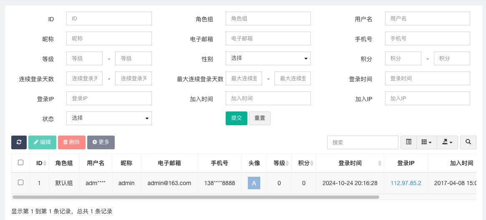

# Set模式应对查询业务

我们先介绍一下repository层User的两种形态：

第一种是以domain.User为参数的增删改查操作
```
Find    
FindOne   
FindMany 
Save 
Modify 
Remove
```
Set模式如何使用呢？以查询举例，通过属性对象的IsPresent函数来决定是否使用该属性，如下：
```go
func (repo *User) query(db *ent.Client, qryUser domain.User) *ent.UserQuery {
    builder := db.User.Query()
    qryUser.ID.IsPresent(func(v int64) { builder.Where(user.ID(v)) })
    qryUser.Mobile.IsPresent(func(v string) { builder.Where(user.Mobile(v)) })
    qryUser.Age.IsPresent(func(v int64) { builder.Where(user.Age(v)) })
    qryUser.Level.IsPresent(func(v int64) { builder.Where(user.Level(v)) })
    qryUser.Nickname.IsPresent(func(v string) { builder.Where(user.Nickname(v)) })
    return builder
}
```
Set模式也完美的解决了增量更新问题，如下：
```go
func (repo *User) modify(ctx context.Context, db *ent.Client, cmdUser domain.User) int {
    builder := db.User.Update()
    cmdUser.Mobile.IsPresent(func(v string) { builder.SetMobile(v) })
    cmdUser.Age.IsPresent(func(v int64) { builder.SetAge(v) })
    cmdUser.Level.IsPresent(func(v int64) { builder.SetLevel(v) })
    cmdUser.Nickname.IsPresent(func(v string) { builder.SetNickname(v) })
    return builder.Where(user.ID(cmdUser.ID.Value)).SaveX(ctx)
}
```

第二种是以依赖倒置方式的增删改查操作
```
Fetch 
FetchOne 
FetchMany 
Create 
Update  
Delete
Count  
Exist 
NotExist
```
开发中我们应该都见过这样的代码：
```
FindByID
FindByName
FindByMobile
FindByNameAndMobile
...
```
依赖倒置可以更加灵活的应对查询的各种操作，请读者自行体会。

为什么每个函数都有对应的私有函数，比如FetchOne对应私有函数fetchOne？<br>
私有函数主要是给事务调用。




开发者都应该见到类似复杂的查询业务，常见于后台管理，商品购买查询等等，这里面包含：<br>
1、等值查询 比如ID、手机号<br>
2、范围查询 比如时间、年龄<br>
3、多值查询 比如等级、状态<br>
4、模糊查询 比如用户名、昵称<br>

对接以上查询业务代码如下，请读者结合示例自行体会。
```go
type UserMany struct {
    Mobile   vo.Mobile
    StartAge user.Age
    EndAge   user.Age
    Levels   user.Levels
    Nickname user.Nickname
}

func (req *UserMany) Validate() error {
    if err := req.Mobile.ValidateOmit(); err != nil {
        return err
    }
    if err := req.StartAge.ValidateOmit(); err != nil {
        return err
    }
    if err := req.EndAge.ValidateOmit(); err != nil {
        return err
    }
    for _, level := range req.Levels {
        if err := level.Validate(); err != nil {
            return err
        }
    }
    if err := req.Nickname.ValidateOmit(); err != nil {
        return err
    }
    if req.StartAge.Set && req.EndAge.Set && req.StartAge.Value >= req.EndAge.Value {
        return errors.New("年龄开始结束非法")
    }
    return nil
}
```
如上所示，正是有了request层的Validate方法，我们应对复杂多变的参数校验需求才会更加从容。

项目结构介绍：<br>
使用了[Ent](https://entgo.io/zh/)数据库框架<br>

request层：接受外部数据 <br>
response层：对外输出数据 <br>
repository层：仓储层，负责与数据源交互，包括数据库、缓存、Api<br>
ent层：数据库实体 <br>
domain层：领域实体 <br>

Mapper转换原则：谁有数据谁负责转换<br>
ent.User有数据，ent.User.Mapper函数负责把自身转换为domain.User<br>
domain.User有数据，domain.User.Mapper函数负责把自身转换为response.User<br>

[源码链接](../chapter6)


